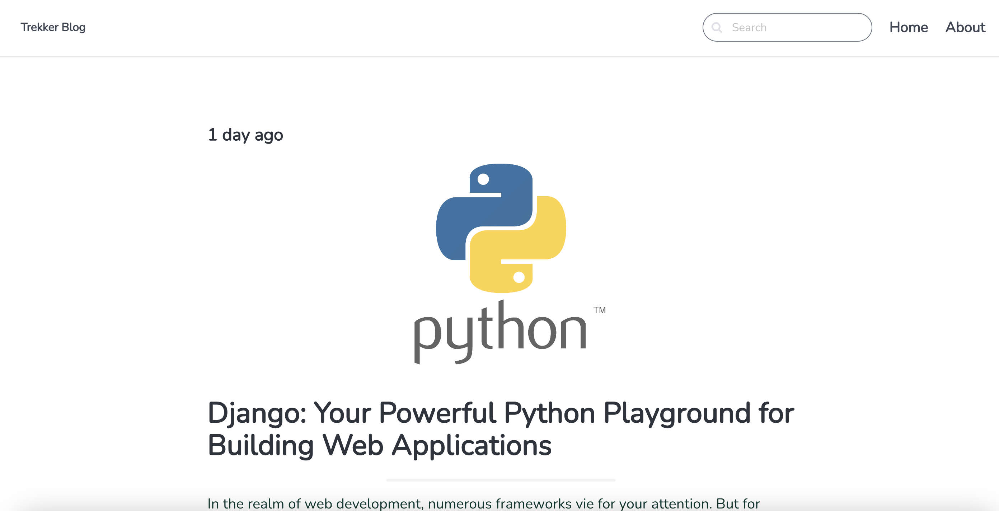

# Trekker Blog Web App

This project showcases a blog web app built with Django for the backend and Tailwind CSS alongside Bulma for the frontend. It offers all the major functionalities of a blog and I've further optimized it for search engines through sitemaps and a robots.txt file.

## Key Features

### Django Backend

Post Categories: Organize posts into categories for improved navigation and search functionality.
Commenting Feature: Foster reader engagement by allowing comments on blog posts.
Search Functionality: Readers can effortlessly find specific topics or keywords within your blog content.
Content Management: Create compelling blog posts with formatted markdown text, ensuring proper rendering on the frontend.
Static Pages: Create informative static pages like "About Us" or "Contact" to enhance reader experience.
Admin Panel: Manage posts, comments, and categories through a user-friendly Django admin interface.
SEO Optimization: Includes a sitemap.xml and robots.txt to improve search engine visibility.

### Frontend (Tailwind & Bulma)

Responsive Design: The blog adapts seamlessly to different screen sizes (desktop, mobile, tablet) ensuring optimal viewing on all devices.

### Important Note

This blog is currently designed for a single author/administrator who manages content through the Django admin panel. Reader accounts are not currently implemented.
